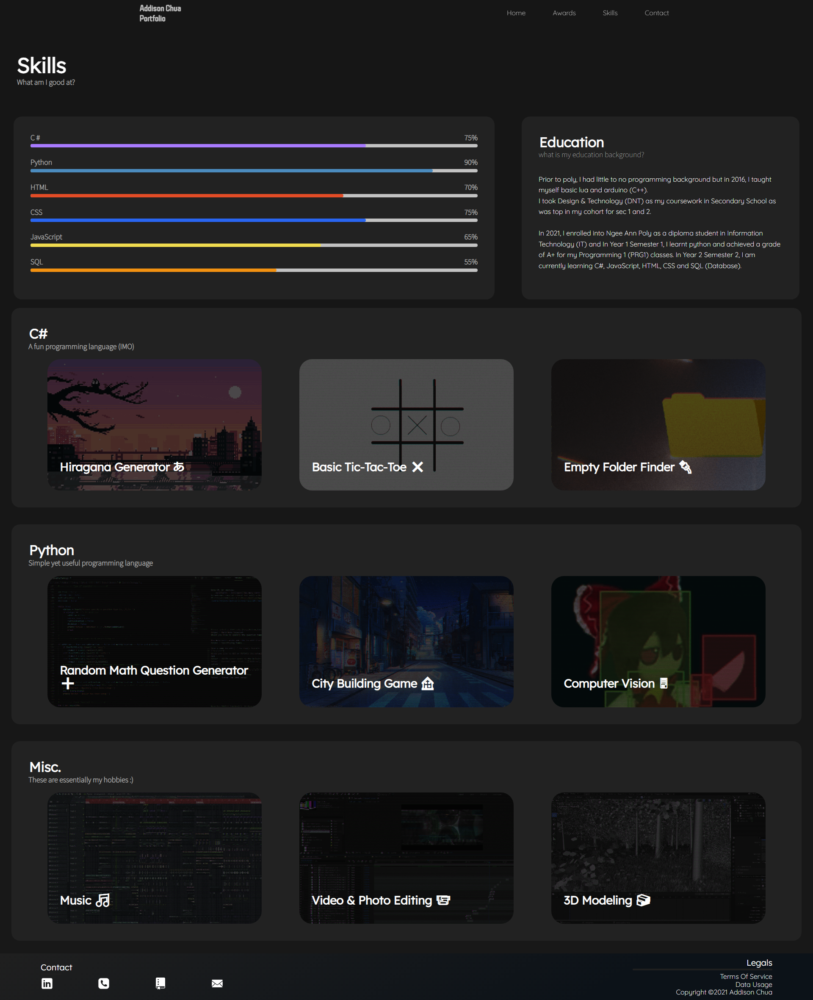

# Addison's Portfolio (ID Assignment 1)
A functional personal portfolio website to display my skills, talents and inform the user more about me.  
The website should be responsive and interactive to impress the audience/user with my current programming knowledge and potentially hire me.

I went with a mainly dark theme as a dark theme would reduce eye fatigue as unlike having to stare at a white screen for too long, dark themes are typically smoother to the eyes and it is less bright (Especially when viewing in the night). However the awards page is an exception as I wanted to user to be "awake" when looking through my achievements which is one of the more important page in my portfolio.

Link to website : https://notaddison.github.io/Portfolio/

## Table of Contents
- [Addison's Portfolio (ID Assignment 1)](#addisons-portfolio-id-assignment-1)
  - [Table of Contents](#table-of-contents)
  - [Design Process](#design-process)
    - [User perspectives:](#user-perspectives)
    - [Process :  ](#process--)
  - [Features (Functionality & Aesthetics)](#features-functionality--aesthetics)
    - [Functionality](#functionality)
    - [Aesthetics](#aesthetics)
    - [Additional Features (For Later)](#additional-features-for-later)
    - [Features Left to Implement](#features-left-to-implement)
  - [Technologies Used](#technologies-used)
  - [Testing](#testing)
    - [Screenshots](#screenshots)
      - [Desktop Preview](#desktop-preview)
      - [Phone Preview](#phone-preview)
    - [Supported Devices](#supported-devices)
    - [Test Case(s)](#test-cases)
    - [Bug(s)](#bugs)
  - [Credits](#credits)
    - [Content](#content)
    - [Media](#media)
    - [Guides/References/Tutorials](#guidesreferencestutorials)
    - [Acknowledgements](#acknowledgements)

## Design Process
 The website is for sharing information to potential employees or friends of mine, to showcase my skills and talents as well as to present myself in a positive and elegant manner.
I want them to achieve this by being able to navigate through the website with ease with as few click as possible while keeping the content neat with a clean and simple layout.

### User perspectives:
- As a potential employer, I want to be stunned at the amount of effort and details placed into the website, so that I can see how interested the programmer (me) is.
- As an average student/friend, I want to be able to know more about my classmate/friend and pinpoint their skills and abilities, so that I can know my classmate's/friend's strength.

### Process :  
1. MS Paint ([Initial Low-Fidelity](https://drive.google.com/file/d/1ySl413qqJpJu97WLOT2eKxpQiHZXQr1M/view?usp=sharing)) - 13/11/21 <b>(OUTDATED)</b>
2. Adobe XD ([High-Fidelity](https://xd.adobe.com/view/961cfa49-90dc-4e72-86d8-00804ce37e64-c34f/)) - 3/12/21 <b>(UPDATED)</b> 

## Features (Functionality & Aesthetics)

### Functionality
- Sticky Navigation bar
  > Users would not have to scroll all the way to the top to access the navigation bar, reducing the hassle to scroll to the top and making the webpage easier to navigate.
- Skills project cards (text on hover)
  > Helps to clean up space to make the skills page look cleaner and not too cluttered by revealing relevant text.

### Aesthetics
- Interactive images (animation on hover)
  > Makes website feel more interactive and less boring when navigating (desktop).
- Typewriting effect in index page
  > Makes website feel more professional and provides a visually appealing aesthetic.
- Fade-in on scroll
  > Makes the website feels "smoother" and shows responsiveness.
- Awards image 3D effect on hover
  > Drop shadow helps to make the images feel like that they are "popping out" from the document background. This makes it more interesting and helps to keep the page unique and less mundane.
- Animated Navigation hamburger & menu for mobile
  > Gives a more "polished feel" and potentially improve the UX (User Experience) instead of having thing shoved and immediately shown to the user's face.
 
### Additional Features (For Later)
- Glitchy transition effect and loading screen.
- Working contact form
- Implement parallax.js & tilt.js

### Features Left to Implement
- NA

## Technologies Used
Languages, framework, libraries & tools

- [Visual Studio Code](https://code.visualstudio.com/)
    - The project used VS Studio (text editor) to code in HTML,CSS & JS
- [Adobe Photoshop](https://www.adobe.com/products/photoshop.html)
  - Used to make the assets and images
- [Adobe XD](https://www.adobe.com/sg/products/xd.html)
  - Used to create the wireframe of the website
- [Normalize CSS](https://necolas.github.io/normalize.css/)
  - An external CSS to make browsers render elements more consistently
- [Live Server](https://marketplace.visualstudio.com/items?itemName=ritwickdey.LiveServer)
  - A VS Code extension used to view a live preview of the html site with CSS and JS.
- [GoFullPage](https://chrome.google.com/webstore/detail/gofullpage-full-page-scre/fdpohaocaechififmbbbbbknoalclacl)
  - Google Chrome extension to take a full webpage screenshot <b>(Buggy when trying to take screenshot while in device emulation mode on Chrome)</b>

## Testing 

### Screenshots
In addition, you should mention in this section how your project looks and works on different browsers and screen sizes.
#### Desktop Preview
> Screenshots taken on a 24" Monitor

#### Phone Preview
> Screenshots taken on a 320px x 825px (chrome emulated device)
<b>(Unable to load as preview as it makes the README.md messy)</b>
- [index.html Mobile](images/Web-Preview/index-page-preview-mobile.png)
- [awards.html Mobile](images/Web-Preview/awards-page-preview-mobile.png)
- [skills.html Mobile](images/Web-Preview/skills-page-preview-mobile.png)
- [contact.html Mobile](images/Web-Preview/contact-page-preview-mobile.png)
- [Navigation Menu Mobile](images/Web-Preview/navigation-menu-mobile.JPG)

### Supported Devices
- [Tested/Supported Devices and Browsers](Tested-Devices.md)

### Test Case(s)
1. Contact form:
    1. Go to the "Contact" page
    2. Submitting an empty form with nothing written down would display an error.
    3. Try to submit the form with an invalid email address and verify that a relevant error message appears
    4. Try to submit the form with all inputs valid and a success alert should appear.
  
2. Parallax scroll:
    1. Go to the "awards" page
    2. Scroll down slowly, text should move apart.
  
3. Fade-in on scroll:
    1. Go to the "awards" page
    2. Scroll down slowly, elements should appear slowly based on the visibility percentage of the element.
  
4. Project card hover
   1. Go to the "skills" page
   2. Scroll down and hover over a project card
   3. Card scale would become slightly bigger and a drop shadow behind it would appear.
   4. Text would be displayed over the project when mouse hover.
  
5. Awards images hover
   1. Go to the "awards" page
   2. Scroll down and hover your mouse over an award image
   3. Award should rotate and display a drop shadow which is casted onto the white background (Gives 3D/popping out illusion)
  
6. Scroll to top
   1. Go to the "awards" page
   2. Scroll down below the parallax image
   3. An arrow button on the bottom right of the screen would slide in from the right and appear
   4. Clicking onto the image/button would bring the user to the parallax text (top)

### Bug(s)
- [x] aboutimage disappears when tapped (aka "hover") [iphone11] (index page)
- [x] Fix media query for Awards page
- [x] Mobile parallax overflow [mobile] (awards page)
- [x] Mask text hard to read (awards page)
- [x] Parallax text appears on NAV menu [mobile] (awards page)
- [ ] Skill year text not loading on iOS 14 (physical iphone 11) [works on android but not iPhone??]

## Credits

### Content
- No text was copied from any external sources.

### Media
- [Social Media Icons](https://icons8.com/)
- [Videos & Images]() < Extracted videos from "Wallpaper Engine" Steam Application
- [Colour Gradients](https://www.eggradients.com/)

### Guides/References/Tutorials
- [Typewriter Effect](https://www.youtube.com/watch?v=mULM6KcF_mo)
- [Hamburger Menu](https://www.youtube.com/watch?v=EW65Ll_9ioE)
- [Text Mask](https://www.youtube.com/watch?v=8eAWHc34MT0)
- [Card Slide Out Text](https://www.youtube.com/watch?v=5DEq5cWNYt8)
- [Fade In On Scroll](https://www.youtube.com/watch?v=5DEq5cWNYt8)
- [Navigation Bar & Skills Progress Bar](https://www.youtube.com/watch?v=tcskp-ncN0I)
- [Custom Scrollbar](https://www.w3schools.com/howto/howto_css_custom_scrollbar.asp)

### Acknowledgements

- Received inspiration from : 
  - [Felipekrust](https://www.felipekrust.com.br/) < Glitchy Effects
  - [TheBlackboardArtist](https://www.theblackboardartist.com/) < Landing Page
